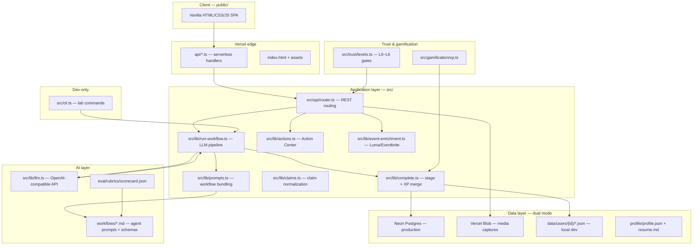

# Architecture & Roadmap — Conference Memory Lab

A single reference for **how the system is built**, **what runs where**, and **how work is prioritized** — written from an **AI product manager** lens.

Use this doc to answer: *What did v0 prove? What does v1 need to prove? What ships next, and why?*

---

## Product thesis (AI PM framing)

**Conference Memory Lab** is not a summarizer. It is a **trust-gated thought partner** that turns messy event inputs into **grounded memory → lens-aware thinking → reviewable action**.

| Layer | Job | AI role |
|-------|-----|---------|
| **Memory** | Who was there, what was said, what stood out | Extract & structure — high grounding bar |
| **Thought partner** | What mattered *for this user*, what to challenge | Synthesize against profile — non-obvious over recap |
| **Action** | Drafts, follow-ups, exports | Generate — only after human has earned trust |
| **Quality loop** | Eval + edit + approve | Human judgment trains the system |

**North star:** After any event, the user quickly knows **what mattered**, **what to think about**, and **what to do next**.

**AI PM guardrail:** Ship the **closed loop with human review** before **automation**. OAuth, auto-publish, and connection automation are **trust rewards**, not day-one features.

---

## Version map — v0 vs v1

| | **v0 — Shipped** | **v1 — Next milestone** |
|---|------------------|-------------------------|
| **Product bet** | The full Remember → Think → Create → Review loop works **in-app** on real events | Users return after every event; output quality **compounds** via profile + review |
| **AI execution** | Server-side LLM (`OPENAI_API_KEY`) runs all four workflows | Eval overrides feed profile; retrieval/context improves per step |
| **User surface** | Single-page workspace on Vercel; no CLI required for mainstream use | Export, approve, reflection, project links — **L3 Editor** experience |
| **Personalization** | Your Lens drives Think/Create when profile exists | Projects, insight applications, knowledge graph |
| **Trust** | L0–L3 capabilities implemented; gates enforced server-side | L3 review/export habit; L4+ integrations still gated |
| **Deploy** | Vercel + optional Neon Postgres + Blob + Clerk | Production hardening, quality metrics, invite cohort |

**v0 success criteria (current):**

- User logs an event, runs Remember → Think → Create → Review **without leaving the app**
- At least one draft or takeaway is usable after a real event
- Trust ladder advances naturally on first event (L0 → L1 → L2 within one session)

**v1 success criteria (target):**

- New user completes onboarding + first event **without reading the README**
- User edits Think output and approves a draft; next event’s voice score trends up
- 3+ events logged; user can find any person or takeaway in &lt;30 seconds

---

## Architecture at a glance (v0)



### Core loop (session pipeline)

Every event is an **`EventSession`** advancing through stages:

| Stage | Tab / verb | Trust | What happens |
|-------|------------|-------|--------------|
| `ingested` | **Attend** | L0 | Log event, notes, link, media, attendance intent |
| `extracted` | **Remember** | L0 | Key takeaways, people, themes from notes + event page context |
| `synthesized` | **Think** | L1 | Assumption challenges, theme ↔ profile connections, mattered line |
| `drafted` | **Create** | L2 | Content angles, LinkedIn draft, follow-up messages |
| `reviewed` | **Review** | L3 | Self-critique eval scores (grounding, voice, lens, non-obviousness) |
| `published` | — | L4+ | Export / publish (v1+) |

**v0 execution model:** User clicks **Run Remember / Think / Create / Review** in the UI. Server calls the LLM with bundled prompts from `workflows/`, parses JSON, normalizes fields (e.g. claims → key takeaway text), merges into session, awards XP, enforces trust gates.

**Dev fallback:** `npm run lab -- prompt|complete` still works for prompt inspection and offline JSON paste — useful for debugging, not the primary user path.

### LLM context by workflow (what the model sees)

| Workflow | Primary inputs | Profile? | Output fields |
|----------|----------------|----------|---------------|
| **extract** (Remember) | `rawNotes`, captures, event page (title, description, topics, speakers) | No (L0) | `people`, `claims`, `themes`, `interactions` |
| **synthesize** (Think) | Extract output + session context | Yes | `themes` (+ `profileConnection`), `assumptionChallenges` |
| **draft** (Create) | Synthesis + profile + resume | Yes | `contentAngles`, `contentDrafts`, `followUpDrafts` |
| **self-critique** (Review) | Drafts + rubric | Yes | `evalScores` (+ suggested edits) |

**AI PM note:** Remember intentionally **does not** load the profile — Observer tier stays privacy-light. Personalization begins at Think.

### Trust ladder (capabilities, not vanity XP)

| Level | Name | XP | Unlocks |
|-------|------|-----|---------|
| L0 | Observer | 0 | Remember — extract memory |
| L1 | Synthesizer | 100 | Think — profile comparison, assumption challenges |
| L2 | Drafter | 200 | Create + Review — angles, drafts, self-critique |
| L3 | Editor | 500 | Export, approve, eval dashboard (v1 UI) |
| L4 | Publisher | 1000 | LinkedIn OAuth, review queue |
| L5 | Networker | 2000 | Speaker graph, batch follow-ups |
| L6 | Autopilot | 4000 | Multi-platform schedule, audit log |

First event XP tuning (v0): Remember 75 + Think 100 → user reaches L2 (200 XP) after one full loop, unlocking Create on event #1.

Implementation: `src/trust/levels.ts` + `src/gamification/xp.ts`.

### Your Lens (personalization layer)

Per-user `profile.json`: expertise areas, voice traits, content priorities, assumption patterns, past post examples. Optional `resume.md` enriches Create/Review.

The AI never gets a generic “summarize this event” job — it interprets through **Your Lens** and is scored on grounding, voice, expertise, and non-obviousness.

### Action Center (product logic on top of state)

`src/lib/actions.ts` computes a **priority-ranked queue** from session stage, profile completeness, and draft state. Home surfaces the **one best next action**, not vanity metrics.

Also shipped in v0: **Content Hub** (post ideas + drafts), **learning streak**, **capacity sidebar** (L1–L6 arc).

### Key directories

```
api/               Vercel serverless entrypoints (one file per route — Hobby 12-fn limit)
profile/           Your Lens template + resume example
workflows/         Agent prompts (Remember → Think → Create → Self-critique)
eval/rubrics/      Review scorecard
src/               TypeScript — models, router, LLM, storage, trust
public/            SPA — Attend / Think / Create / Review tabs
data/users/        Local per-user sessions + progress (gitignored)
specs/             Product direction, this doc, level specs
examples/pipeline/ Sample extract → synthesize → draft JSON
```

---

## Tech stack (v0)

| Layer | Choice | Why |
|-------|--------|-----|
| **Runtime** | Node.js 22+ | Serverless + local dev in one repo |
| **Language** | TypeScript (ESM) | Shared types across API, CLI, models |
| **Hosting** | Vercel | Static SPA + serverless API |
| **HTTP** | `node:http` locally; `@vercel/node` in prod | Minimal surface; explicit routes |
| **Frontend** | Vanilla HTML/CSS/JS | Fast iteration, no bundler |
| **Database** | Neon Postgres (prod) / JSON files (local) | `DATABASE_URL` toggles mode in `src/lib/storage.ts` |
| **Media** | Vercel Blob | Photos, audio, video captures |
| **Auth** | Clerk (optional) | `CLERK_*` keys; dev falls back to `local-dev` user |
| **AI** | OpenAI-compatible API | `OPENAI_API_KEY`, optional `LLM_MODEL` / `LLM_BASE_URL` |
| **Orchestration** | Markdown workflows + server runner | Inspectable prompts; JSON schema in workflow files |
| **Eval** | JSON rubrics + LLM self-critique | Human override path planned for v1 |

**Env vars:** see `.env.example`.

**Vercel constraint:** Hobby plan = 12 serverless functions. Each `api/**/*.ts` file counts. `/api/health` is droppable if a slot is needed.

---

## What v0 shipped (capability checklist)

| Capability | Status | Notes |
|------------|--------|-------|
| Log event (title, type, notes, link, intent) | ✅ | Attend tab + API |
| Event page enrichment (Luma, Eventbrite, etc.) | ✅ | Ahead of original L5 roadmap |
| Media capture (photo/audio/video) | ✅ | Blob or local |
| **Remember** — in-app LLM extract | ✅ | Re-runnable; key takeaways UX label |
| **Think** — in-app LLM synthesize | ✅ | Editable + Save edits (`matteredLine`, themes, challenges, angles) |
| **Create** — in-app LLM draft | ✅ | Angles, LinkedIn draft, follow-ups |
| **Review** — in-app LLM self-critique | ✅ | Four-dimension eval scores |
| Trust ladder + XP + capacity UI | ✅ | Gates enforced in `run-workflow.ts` |
| Action Center + Content Hub | ✅ | Home prioritizes next step |
| Onboarding walkthrough | ✅ | 5-step tour; `PATCH /api/onboarding` |
| Your Lens edit | ✅ | Profile modal |
| Local dev (no cloud keys) | ✅ | JSON under `data/users/` |
| Production deploy | ✅ | Vercel + Neon + Blob + Clerk |
| CLI lab commands | ✅ | Dev/debug only |

**Explicitly not in v0:**

- Export to clipboard / markdown (L3 — v1)
- Approve draft → profile feedback loop (L3 — v1)
- LinkedIn OAuth / auto-publish (L4+)
- Audio transcription (Otter/Fireflies)
- Knowledge graph visualization
- `Project` / `InsightApplication` entities

---

## v1 roadmap — AI PM priorities

### Theme A: **Quality compounds** (highest leverage)

| # | Item | User outcome | AI PM rationale |
|---|------|--------------|-----------------|
| A1 | **Eval override → profile** | Next draft sounds more like me | Closes the learning loop; without it, AI is stateless across events |
| A2 | **Grounding UX** | I trust every takeaway | Show source refs inline; flag low-confidence extractions |
| A3 | **Think reflection field** | “What changed my thinking?” | Captures human insight the model cannot infer — high-signal training data |
| A4 | **Re-run Think** (parity with Remember) | Iterate without losing edits | Users need same re-run affordance as Remember |

### Theme B: **Habit & clarity**

| # | Item | User outcome | AI PM rationale |
|---|------|--------------|-----------------|
| B1 | **L3 Editor flow** | Approve → export → unlock L4 framing | Trust ladder needs a visible “graduate” moment |
| B2 | **Onboarding → first event without docs** | I’m productive on event #1 | Lens completion + guided first Remember |
| B3 | **Project links in Think** | “Apply to Frontera eval framework” | Bridges memory → action; differentiator vs generic notes |
| B4 | **Knowledge graph (session-scoped)** | See Speaker → Takeaway → Theme → Draft | Makes memory legible; supports trust |

### Theme C: **Scale & ops** (after A + B)

| # | Item | Notes |
|---|------|-------|
| C1 | Multi-user cohort metrics | Completion rate per loop step, eval distributions |
| C2 | Prompt versioning + A/B | Workflow changes need measurable impact |
| C3 | L4 LinkedIn OAuth (review queue only) | Still no blind auto-post |
| C4 | Audio ingest → transcript → Remember | Extends input surface |

**v1 exit criteria:** A beta user logs 3 events, edits Think output, approves one draft, and reports the second event’s draft required less editing than the first.

---

## Later horizons (v2+)

| Horizon | Focus | Trust gate |
|---------|-------|------------|
| **v2 — Networker** | Speaker graph, batch follow-ups, calendar/Luma integrations | L5 |
| **v3 — Publisher** | LinkedIn review queue, multi-format export | L4 |
| **v4 — Autopilot** | Scheduled publish, connection automation, audit log | L6 |

**Do not conflate trust levels with build sequence.** A user can be L2 while the product only implements L3 UI — that’s a delivery gap, not a trust bug.

---

## Data model (high level)

Central entity: **`EventSession`** (`src/models/types.ts`)

| Group | Fields |
|-------|--------|
| **Inputs** | `rawNotes`, `screenshotDescriptions`, `eventUrl`, `eventEnrichment`, `attendanceIntent`, `captures` |
| **Memory (Remember)** | `people`, `interactions`, `claims` (UI: **key takeaways**), `themes` |
| **Thought partner (Think)** | `assumptionChallenges`, `matteredLine`, theme `profileConnection` / `relation` |
| **Outputs (Create / Review)** | `contentAngles`, `followUpDrafts`, `contentDrafts`, `evalScores` |
| **Meta** | `stage`, `trustLevelAtCreation`, `xpEarned`, `userId` |

**Planned for v1** (not all in types yet):

- `Project` — user’s active work
- `InsightApplication` — takeaway/theme → project → suggested action
- `userReflection` — “What changed my thinking?”

---

## API surface (v0)

| Method | Path | Purpose |
|--------|------|---------|
| GET | `/api/config` | Auth + storage mode flags for client |
| GET | `/api/dashboard` | Home — progress, actions, sessions, onboarding, content hub |
| PATCH | `/api/onboarding` | Tour progress |
| GET/PUT | `/api/profile` | Your Lens |
| POST | `/api/events/preview-url` | Preview event link before session create |
| GET/POST | `/api/sessions` | List / create session |
| GET/PATCH | `/api/sessions/:id` | Read / update notes, intent, think edits |
| POST | `/api/sessions/:id/enrich-event` | Refresh event page scrape |
| POST | `/api/sessions/:id/workflows/{extract\|synthesize\|draft\|self-critique}` | Run LLM pipeline step |
| POST/GET/DELETE | `/api/sessions/:id/captures/...` | Media upload / serve / remove |

---

## CLI surface (dev)

```bash
npm run dev                              # Local server :3000
npm run lab -- new --title "..." --notes notes.md
npm run lab -- prompt extract|synthesize|draft|self-critique --session <id>
npm run lab -- complete extract|synthesize|draft --session <id> --json <file>
npm run lab -- list | show <id> | status | bootstrap
```

`bootstrap` sets dev XP to L2 for pipeline testing.

---

## Design test (every screen)

From `specs/product-direction.md`:

> Does this help the user know **what mattered**, **what to think about**, or **what to do next**?

If it only shows data without a clear action, demote or remove it.

---

## Related docs

| Doc | Focus |
|-----|-------|
| [README.md](../README.md) | Quick start, principles |
| [specs/product-direction.md](./product-direction.md) | v0/v1 UX, vocabulary, tab design |
| [specs/level-0.md](./level-0.md) | L0–L2 eval thresholds, XP rewards |
| [specs/onboarding-walkthrough.md](./onboarding-walkthrough.md) | First-run tour |
| [examples/pipeline/README.md](../examples/pipeline/README.md) | Sample pipeline JSON |
