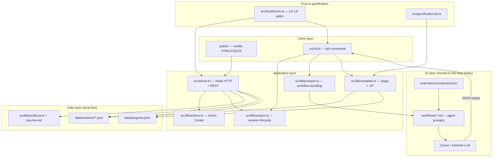

# Architecture & Roadmap — Conference Memory Lab

A single reference for **how the system is built**, **what it runs on**, and **how work is prioritized** (MVP, P0, P1, …) from an AI product manager lens.

---

## What this product is

**Conference Memory Lab** is a **thought partner workspace** that turns networking event notes into **action** — what mattered, what to think deeper about, and what to do next.

It is **not** a notes dashboard. It is an **interaction memory system** with:

- A structured memory graph (people, claims, themes)
- Profile-aware synthesis (“Your Lens”)
- Draft generation with visible reasoning and eval scores
- A **trust ladder** that unlocks capabilities as the user reviews and approves output

**North star:** After any event, the user quickly knows what mattered, what to think about, and what to do next.

---

## Architecture at a glance



### Core loop (session pipeline)

Every event becomes an **EventSession** that advances through stages:

| Stage | User verb | Trust level | What happens |
|-------|-----------|-------------|--------------|
| `ingested` | Attend | L0 | User logs title, notes, optional event link |
| `extracted` | Remember | L0 | Claims, people, themes extracted from notes |
| `synthesized` | Think | L1 | Themes compared to Your Lens; assumption challenges |
| `drafted` | Create / Connect | L2 | Content angles, LinkedIn draft, follow-up message |
| `reviewed` | Review | L3 | Human approves; eval overrides train the profile |
| `published` | — | L4+ | Export or publish (future) |

Today, **Remember → Think → Create** runs as a **human-in-the-loop pipeline**: the CLI generates a Cursor-ready prompt from `workflows/`, the user runs it in an external LLM, then pastes JSON back via `npm run lab -- complete`.

### Trust ladder (capabilities, not vanity XP)

Trust levels gate what the system is allowed to do. XP is a progress signal; **unlocked capabilities** are the user-facing story.

| Level | Name | Unlocks |
|-------|------|---------|
| L0 | Observer | Remember — extract memory from notes |
| L1 | Synthesizer | Think — connect learnings to Your Lens |
| L2 | Drafter | Create — angles, drafts, follow-ups |
| L3 | Editor | Review & export — approve before sharing |
| L4 | Publisher | LinkedIn OAuth, review queue |
| L5 | Networker | Event link parsing, connection drafts |
| L6 | Autopilot | Multi-platform schedule, audit log |

Implementation: `src/trust/levels.ts` (gates) + `src/gamification/xp.ts` (rewards).

### Your Lens (personalization layer)

`profile/profile.json` holds expertise areas, voice traits, content priorities, and past post examples. Optional `profile/resume.md` enriches onboarding.

The AI does not get a generic “summarize this event” job — it interprets the event **through the user’s lens** and is scored on grounding, voice, expertise, and non-obviousness (`eval/rubrics/scorecard.json`).

### Action Center (product logic on top of state)

`src/lib/actions.ts` computes a **priority-ranked queue** of next steps from session stage, profile completeness, and draft state. The home screen surfaces the **one best next action**, not vanity metrics.

### Key directories

```
profile/           Your Lens — expertise, voice, resume
workflows/         Agent prompts (Remember → Think → Create → Self-critique)
eval/rubrics/      Review scorecard dimensions and thresholds
src/               TypeScript — models, server, CLI, trust, storage
public/            Static UI served by the local server
data/              Local sessions + progress (gitignored in real use)
specs/             Product direction, MVP spec, this doc
examples/pipeline/ Sample extract → synthesize → draft JSON
```

---

## Tech stack

| Layer | Choice | Why |
|-------|--------|-----|
| **Runtime** | Node.js 22+ | Simple local server + CLI in one repo |
| **Language** | TypeScript (ESM) | Shared types between API, CLI, and models |
| **Execution** | `tsx` | Run TS without a build step in dev |
| **HTTP server** | `node:http` (no framework) | Minimal surface area for a local-first tool |
| **Frontend** | Vanilla HTML/CSS/JS | No bundler; fast iteration on a single-page workspace |
| **Storage** | JSON files on disk | Local-first; profile and sessions stay on the machine |
| **AI orchestration** | Markdown workflow prompts + Cursor | Explicit prompts, inspectable reasoning, no API key in v0.1 |
| **Eval** | JSON rubrics + human override | Measurable quality; overrides feed back into profile |
| **Package manager** | npm | Standard scripts: `dev`, `lab`, `typecheck` |

**Dependencies (runtime):** none — only devDependencies (`typescript`, `tsx`, `@types/node`).

**Not in stack (yet):** database, auth provider, hosted LLM API, React/Vue, Docker, cloud deploy.

---

## Product priorities — AI PM framing

### How to read MVP vs P0 / P1 / P2

| Term | Meaning in this project |
|------|-------------------------|
| **MVP** | Smallest version that proves the **core job**: after a real event, the user gets grounded memory, lens-aware thinking, and at least one usable draft — with eval and trust framing |
| **P0** | Must ship for MVP to be **credible and demoable** on real events. If P0 slips, the product does not fulfill the north star |
| **P1** | Strongly improves **retention and daily use** right after MVP; users can live without it for event #1 but not for event #5 |
| **P2** | **Trust expansion** — export, review workflows, integrations that require proven human judgment |
| **P3+** | **Automation and network effects** — OAuth, parsing, scheduling; only after the user has trained the system via review |

**AI PM principle:** Ship the **closed loop with human review** before **automation**. Integrations (LinkedIn, Luma) are trust rewards, not day-one features.

---

### MVP (v0.1) — “Prove the thought partner loop”

**User story (from `specs/level-0.md`):**

> After a 2-hour SF tech mixer, I paste rough notes. The lab extracts who I met and what I learned, challenges one assumption, surfaces a non-obvious insight aligned with my lens, and drafts a LinkedIn follow-up — all with visible reasoning and citations.

**Scope:** Trust levels **L0–L2** only. No OAuth, no auto-publish, no Luma scraping.

| Capability | Status |
|------------|--------|
| Log event (title, type, notes, optional link) | Shipped — UI + API + CLI |
| Remember (extract → claims, people, themes) | Shipped — workflow + CLI `complete extract` |
| Think (synthesize vs profile, assumption challenges) | Shipped — workflow + CLI `complete synthesize` |
| Create (angles, LinkedIn draft, follow-up) | Shipped — workflow + CLI `complete draft` |
| Eval rubrics (grounding, voice, lens, non-obviousness) | Shipped — rubric + workflow self-critique |
| Your Lens (profile.json + resume) | Shipped — partial UI for edit |
| Trust ladder + XP | Shipped |
| Action Center (best next step) | Shipped — server-side logic + home UI |
| Local-first JSON storage | Shipped |

**MVP success criteria (after 3 real events):**

- Find any person/conversation within 30 seconds
- At least one draft per event is “send as-is” quality
- Eval scores trend up as profile corpus grows

**Explicitly out of MVP scope:**

- Instagram, auto-publish, LinkedIn OAuth
- Audio transcription (Otter/Fireflies later)
- Luma/event page scraping (URL stored at L0; parsed at L5)

---

### P0 — Must-have for MVP credibility

These are the **non-negotiables** inside the L0–L2 boundary. If any fail, the MVP story breaks.

| # | Item | Rationale |
|---|------|-----------|
| P0.1 | **End-to-end pipeline** ingest → extract → synthesize → draft | Core product; without it, it’s a notes app |
| P0.2 | **Grounding + citations** on every claim | Trust foundation; eval dimension “grounding ≥ 80” |
| P0.3 | **Your Lens** drives synthesis and drafts | Differentiator vs generic event summarizers |
| P0.4 | **Eval on every L2 run** with human override path | Quality loop; overrides improve future runs |
| P0.5 | **Trust gates** — no drafts before L2, no profile compare before L1 | Safety and positioning (“earn automation”) |
| P0.6 | **One clear next action** on home | Action over analytics — product promise |
| P0.7 | **Local-first** — no required cloud or API keys | Privacy and solo-founder velocity |

*Most P0 items are implemented in v0.1; the main gap is **tighter UI ↔ CLI integration** (running workflows from the UI without manual JSON paste is post-MVP polish, not a P0 spec change).*

---

### P1 — Retention and “I open this after every event”

Aligned with `specs/product-direction.md` build priority. These make the product **habit-forming** after the first successful run.

| # | Item | User outcome | Notes |
|---|------|--------------|-------|
| P1.1 | **Home redesign** — latest event hero + Action Center + Your Lens | “I know what to do next” in &lt;5 seconds | Partially shipped |
| P1.2 | **Think tab enrichment** — what mattered, project connections, `userReflection` | Thought partner, not recap | Data model spec’d; UI thin |
| P1.3 | **Onboarding** — resume upload / bio / paste posts | Lens complete before event #2 | Profile status exists; wizard incomplete |
| P1.4 | **New Event wizard** — notes, link, photos in one flow | Lower friction to log while tired post-event | API exists; wizard UX partial |
| P1.5 | **Session detail tabs** — Remember / Think / Create / Connect / Review | Vocabulary matches mental model | UI scaffolded in `public/` |
| P1.6 | **Knowledge graph view** (session-scoped) | See path: Speaker → Claim → Theme → Project → Content | Not built |
| P1.7 | **In-app workflow trigger** (optional API LLM) | No copy-paste JSON for mainstream users | Architecture stays prompt-based |

**P1 exit criteria:** A new user completes onboarding, logs an event, and finishes Think + one draft **without reading the README**.

---

### P2 — Review, export, and trust level L3

Unlock **Editor** — human-approved output leaves the app.

| # | Item | Trust gate |
|---|------|------------|
| P2.1 | Export to clipboard / markdown file | L3 |
| P2.2 | Approve draft flow + XP for approval | L3 |
| P2.3 | Eval dashboard with overrides persisted to profile | L3 |
| P2.4 | Multi-platform format (same insight, LinkedIn vs newsletter) | L3 |

**P2 exit criteria:** User approves a draft, exports it, and eval overrides measurably change the next draft’s voice score.

---

### P3 — Publisher & Networker (L4–L5)

**Only after** the user has reviewed drafts — integrations are framed as **earned**, not paywalled.

| # | Item | Level |
|---|------|-------|
| P3.1 | LinkedIn OAuth + review queue (no blind auto-post) | L4 |
| P3.2 | Parse event URLs (Luma, Eventbrite) for speakers/context | L5 |
| P3.3 | Speaker graph + batch connection/follow-up drafts | L5 |
| P3.4 | Structured `Project` + `InsightApplication` entities | L5 enabler |

---

### P4 — Autopilot (L6)

| # | Item |
|---|------|
| P4.1 | Multi-platform scheduled publish |
| P4.2 | Connection send automation (with audit) |
| P4.3 | Audit log + rollback |

**AI PM guardrail:** L6 is a **destination**, not a launch target. Autopilot without L3 review history produces off-brand, off-grounding output at scale.

---

## Two axes: trust levels vs build priorities

Do not conflate them:

| Axis | What it is | Example |
|------|------------|---------|
| **Trust level (L0–L6)** | **User progress** — what capabilities unlock as they earn XP and approve output | L2 unlocks draft generation |
| **Build priority (P0–P4)** | **Engineering sequence** — what the team ships when | P1 ships Think tab before P3 ships LinkedIn OAuth |

A user can be at **L2** while the product only **implements UI for L0–L1** — that’s a P1 delivery gap, not a trust bug.

---

## Data model (high level)

Central entity: **`EventSession`** (`src/models/types.ts`)

- **Inputs:** `rawNotes`, `screenshotDescriptions`, `eventUrl`, `eventType`
- **Memory:** `people`, `interactions`, `claims`, `themes`
- **Thought partner:** `assumptionChallenges`, theme `relation` + `profileConnection`
- **Outputs:** `contentAngles`, `followUpDrafts`, `contentDrafts`, `evalScores`
- **Meta:** `stage`, `trustLevelAtCreation`, `xpEarned`

**Planned entities** (product direction, not all in types yet):

- `Project` — user’s active work
- `InsightApplication` — claim/theme → project → suggested action
- `ActionItem` — typed next step (partially implemented in `actions.ts`)
- `userReflection` — “What changed my thinking?” per session

---

## API surface (today)

| Method | Path | Purpose |
|--------|------|---------|
| GET | `/api/dashboard` | Home — progress, actions, sessions, featured session, lens |
| GET/PUT | `/api/profile` | Read/update Your Lens |
| GET/POST | `/api/sessions` | List / create event session |
| GET/PATCH | `/api/sessions/:id` | Read / add event link |

Static assets: `public/` served on `GET /`.

---

## CLI surface (today)

```bash
npm run lab -- new --title "..." --type mixer --notes notes.md
npm run lab -- prompt extract|synthesize|draft|self-critique --session <id>
npm run lab -- complete extract|synthesize|draft --session <id> --json <file>
npm run lab -- list | show <id> | status | bootstrap
```

`bootstrap` sets dev XP to L2 for pipeline testing.

---

## Design test (every screen)

From `specs/product-direction.md`:

> Does this help the user know **what mattered**, **what to think about**, or **what to do next**?

If it only shows data without a clear action, demote or remove it.

---

## Related docs

| Doc | Focus |
|-----|-------|
| [README.md](../README.md) | Quick start, principles, trust table |
| [specs/product-direction.md](./product-direction.md) | UX vocabulary, home/session design, build priority list |
| [specs/level-0.md](./level-0.md) | L0–L2 MVP spec, eval thresholds, XP rewards |
| [examples/pipeline/README.md](../examples/pipeline/README.md) | Sample full pipeline run |
